# 📊 Current RAG Baseline Evaluation Report (Report Structure)

> **Evaluation Type**: Baseline Pre-Implementation Assessment  
> **Test Cases**: 18 realistic software engineering PFE scenarios (English & French)  
> **Embedding Model**: `sentence-transformers/paraphrase-multilingual-MiniLM-L12-v2`  
> **Database**: MongoDB Atlas (`pfe_chunks` [3,092 chunks], `pfe_structures` [31 reports], `pfe_documents` [31 docs])  
> **Pipeline Evaluated**: Current production RAG implementation (`reportStructureRagService.js` + `reportStructurePromptBuilder.js`)

---

## 1. Executive Summary & Overall Baseline Scores

| Metric | Baseline Score | Description |
| :--- | :---: | :--- |
| **Context Relevance** | **`0.355`** / 1.000 | Semantic precision & relevance of retrieved PFE thesis references to project domain. |
| **Context Recall** | **`0.825`** / 1.000 | Completeness of academic thesis chapters (Intro, SOTA, Requirements, UML Design, Realization, Testing). |
| **Faithfulness & Grounding** | **`0.994`** / 1.000 | Degree to which the generated outline remains grounded in the user's requirements without hallucinating foreign domains. |
| **Structure Quality** | **`0.872`** / 1.000 | Conformity to standard 5–8 chapter hierarchy and nested section depth. |
| **Composite RAG Baseline** | **`0.710`** / 1.000 | Weighted overall performance index. |
| **Avg Retrieval Latency** | `18833 ms` | Time taken to compute query embeddings and query MongoDB. |
| **Avg Generation Latency** | `130586 ms` | Time taken by LLM to generate the full JSON table of contents. |

```mermaid
gantt
    title Baseline RAG Performance Breakdown
    dateFormat X
    axisFormat %s
    Context Relevance (35%)    :0, 35
    Context Recall (82%)       :0, 82
    Faithfulness (99%)         :0, 99
    Structure Quality (87%)    :0, 87
```



---

## 2. Dataset Description & Methodology

The evaluation dataset comprises **18 diverse, academically realistic software engineering PFE projects** across both English and French:
- **Domains Evaluated**: IoT & Precision Agriculture, Telemedicine & Medical EHR, High-Throughput Fintech Payment Gateway, E-Commerce Microservices, AI/NLP Chatbot & Sentiment, Cybersecurity SIEM, GPS Fleet Management, EdTech Exam Proctoring, Blockchain Supply Chain Traceability, Mobile Banking, Cloud-Native DevOps & GitOps, PropTech 3D Virtual Tours, AR/VR Industrial Maintenance, HR Resume Parsing NLP, Distributed Video Streaming, Autonomous Warehouse Robotics, Smart City Waste Management, and Clinical Trials Compliance.
- **Input Artifacts per Case**: Problem Statement, Objectives, Tech Stack, Actors, Functional Requirements, Non-Functional Requirements, Product Backlog user stories, and UML Class / Use Case lists.

### Metrics Measurement Policy:
- **Context Relevance / Precision**: Measures cosine similarity and domain token overlap between the project's generated semantic query and the retrieved PFE document chunks and table of contents.
- **Context Recall (Academic Coverage)**: Measures whether the retrieved reference covers the canonical software engineering PFE lifecycle stages (Methodology, Requirements, UML Design, Implementation, Testing, Perspectives).
- **Faithfulness (Domain Grounding)**: Evaluates whether the generated table of contents adheres strictly to the student's project specifications without hallucinating concepts from misaligned retrieved documents.
- **Ground Truth Limitation Notice**: In a subjective task like academic table of contents generation, exact string matching against a single outline is invalid because multiple valid structures exist. Therefore, ground truth is formulated based on required academic stages and domain concept coverage rather than rigid identical titles.

---

## 3. Detailed Results per Test Case

| Case ID | Project Domain | Language | Context Relevance | Context Recall | Faithfulness | Composite Score | Chapters |
| :--- | :--- | :---: | :---: | :---: | :---: | :---: | :---: |
| **case-01** | IoT & Smart Agriculture | English | `0.314` | `0.857` | `1.000` | **`0.693`** | 9 |
| **case-02** | Santé & Télémédecine | French | `0.382` | `0.714` | `1.000` | **`0.712`** | 8 |
| **case-03** | Fintech & Cybersecurity | English | `0.307` | `0.857` | `1.000` | **`0.690`** | 9 |
| **case-04** | E-Commerce & Cloud Microservices | French | `0.401` | `0.857` | `1.000` | **`0.723`** | 9 |
| **case-05** | AI & Natural Language Processing | English | `0.374` | `0.857` | `1.000` | **`0.714`** | 9 |
| **case-06** | Cybersécurité & SIEM | French | `0.361` | `0.857` | `1.000` | **`0.741`** | 8 |
| **case-07** | IoT, Logistique & Mobilité | French | `0.380` | `0.857` | `1.000` | **`0.747`** | 8 |
| **case-08** | EdTech & Computer Vision | English | `0.422` | `0.857` | `1.000` | **`0.731`** | 9 |
| **case-09** | Blockchain & Supply Chain | French | `0.364` | `0.714` | `1.000` | **`0.675`** | 9 |
| **case-10** | Banque Mobile & Sécurité | French | `0.349` | `0.857` | `0.962` | **`0.727`** | 8 |
| **case-11** | DevOps & Cloud Infrastructure | English | `0.380` | `0.714` | `1.000` | **`0.712`** | 8 |
| **case-12** | Immobilier & Vision 3D / IA | French | `0.363` | `0.857` | `1.000` | **`0.741`** | 8 |
| **case-13** | AR/VR & Industrial IoT | English | `0.292` | `0.857` | `0.962` | **`0.675`** | 9 |
| **case-14** | Ressources Humaines & NLP | French | `0.390` | `0.714` | `0.962` | **`0.674`** | 9 |
| **case-15** | Multimedia & Cloud Video Streaming | English | `0.331` | `0.857` | `1.000` | **`0.699`** | 9 |
| **case-16** | Robotics & Autonomous Systems | English | `0.250` | `0.857` | `1.000` | **`0.670`** | 9 |
| **case-17** | Smart City & Optimisation Logistique | French | `0.328` | `0.857` | `1.000` | **`0.698`** | 9 |
| **case-18** | Santé, Recherche Clinique & Conformité | French | `0.401` | `0.857` | `1.000` | **`0.755`** | 8 |

---

## 4. In-Depth Analysis: Retrieval Strengths vs. Weaknesses

### 🟢 Examples of Strong Retrieval

#### Case **case-18** — *Plateforme de Recrutement et Suivi des Essais Cliniques* (Composite: `0.755`)
- **Domain**: Santé, Recherche Clinique & Conformité (French)
- **Context Relevance**: `0.401` | **Context Recall**: `0.857` | **Faithfulness**: `1.000`
- **Generated Outline Preview**:
  - Introduction Générale
  - Contexte et Motivation
  - Problématique du Recrutement Clinique
  - Objectifs du Projet TrialMatch
  - Périmètre et Livrables
  - Structure du Rapport
  - Cadre Organisationnel et Projet
  - Organisme d'Accueil : BioTrial Research
- **Retrieved Context Snippet**:
```text
Retrieved PFE report structures for internal academic guidance:

Reference 1: RAPPORT PFE Edited (3) (1).pdf
Language: en
Structure relevance score: 179.5
Table of contents:
- Introduction
- 1 Host Organization
  - 1.1 Bee Coders
  - 1.2 Services
- 2 Project Presentation :
  - 2.1 Problem Statement
- 3 Existing Solutions
  - 3.1 Criticism of the ex...
```

#### Case **case-07** — *Système de Gestion de Flotte et Suivi GPS en Temps Réel* (Composite: `0.747`)
- **Domain**: IoT, Logistique & Mobilité (French)
- **Context Relevance**: `0.380` | **Context Recall**: `0.857` | **Faithfulness**: `1.000`
- **Generated Outline Preview**:
  - Introduction Générale
  - Contexte et Motivation
  - Problématique de la Gestion de Flotte
  - Objectifs du Projet FleetTrack
  - Périmètre et Livrables
  - Organisation du Rapport
  - Contexte Organisationnel et Projet
  - Présentation de l'Entreprise d'Accueil TransLogistics
- **Retrieved Context Snippet**:
```text
Retrieved PFE report structures for internal academic guidance:

Reference 1: RAPPORT PFE Edited (3) (1).pdf
Language: en
Structure relevance score: 179.5
Table of contents:
- Introduction
- 1 Host Organization
  - 1.1 Bee Coders
  - 1.2 Services
- 2 Project Presentation :
  - 2.1 Problem Statement
- 3 Existing Solutions
  - 3.1 Criticism of the ex...
```

#### Case **case-06** — *Plateforme SIEM et Détection d'Intrusions Cyberdéfense* (Composite: `0.741`)
- **Domain**: Cybersécurité & SIEM (French)
- **Context Relevance**: `0.361` | **Context Recall**: `0.857` | **Faithfulness**: `1.000`
- **Generated Outline Preview**:
  - Introduction
  - Contexte et Motivation
  - Problématique des PME en Cybersécurité
  - Objectifs du Projet CyberShield
  - Périmètre et Livrables
  - Structure du Rapport
  - Contexte Organisationnel et Étude de l'EXISTANT
  - Présentation de l'Organisme d'Accueil SecurGroup
- **Retrieved Context Snippet**:
```text
Retrieved PFE report structures for internal academic guidance:

Reference 1: RAPPORT PFE Edited (3) (1).pdf
Language: en
Structure relevance score: 189.5
Table of contents:
- Introduction
- 1 Host Organization
  - 1.1 Bee Coders
  - 1.2 Services
- 2 Project Presentation :
  - 2.1 Problem Statement
- 3 Existing Solutions
  - 3.1 Criticism of the ex...
```

### 🔴 Examples of Poor Retrieval / Domain Mismatch

#### Case **case-13** — *AR/VR Industrial Equipment Maintenance & Training Simulator* (Composite: `0.675`)
- **Domain**: AR/VR & Industrial IoT (English)
- **Context Relevance**: `0.292` | **Context Recall**: `0.857` | **Faithfulness**: `0.962`
- **Identified Mismatch**: Retrieved generic or weakly aligned PFE references where domain-specific keywords had insufficient vector density in the current document repository.
- **Retrieved Context Snippet**:
```text
Retrieved PFE report structures for internal academic guidance:

Reference 1: RAPPORT PFE Edited (3) (1).pdf
Language: en
Structure relevance score: 239.5
Table of contents:
- Introduction
- 1 Host Organization
  - 1.1 Bee Coders
  - 1.2 Services
- 2 Project Presentation :
  - 2.1 Problem Statement
- 3 Existing Solutions
  - 3.1 Criticism of the ex...
```

#### Case **case-14** — *Système de Recrutement Intelligent avec Parsing de CV et Matching NLP* (Composite: `0.674`)
- **Domain**: Ressources Humaines & NLP (French)
- **Context Relevance**: `0.390` | **Context Recall**: `0.714` | **Faithfulness**: `0.962`
- **Identified Mismatch**: Retrieved generic or weakly aligned PFE references where domain-specific keywords had insufficient vector density in the current document repository.
- **Retrieved Context Snippet**:
```text
Retrieved PFE report structures for internal academic guidance:

Reference 1: RAPPORT PFE Edited (3) (1).pdf
Language: en
Structure relevance score: 189.5
Table of contents:
- Introduction
- 1 Host Organization
  - 1.1 Bee Coders
  - 1.2 Services
- 2 Project Presentation :
  - 2.1 Problem Statement
- 3 Existing Solutions
  - 3.1 Criticism of the ex...
```

#### Case **case-16** — *Autonomous Warehouse Robotics Navigation & SLAM Fleet Coordinator* (Composite: `0.670`)
- **Domain**: Robotics & Autonomous Systems (English)
- **Context Relevance**: `0.250` | **Context Recall**: `0.857` | **Faithfulness**: `1.000`
- **Identified Mismatch**: Retrieved generic or weakly aligned PFE references where domain-specific keywords had insufficient vector density in the current document repository.
- **Retrieved Context Snippet**:
```text
Retrieved PFE report structures for internal academic guidance:

Reference 1: AI-Powered Sentiment and Engagement Analysis for Social Media
Language: en
Structure relevance score: 209.5
Table of contents:
- General Introduction
- Project Overview and Framework
  - Introduction
  - 2.1 BeeCoders Overview
  - 2.2 9antra.tn / The Bridge
  - 2.3 BeeCod...
```

---

## 5. Key Weaknesses Discovered in the Current RAG Implementation

1. **Atlas Vector Search Index Status**: In the current database configuration, the primary `$vectorSearch` index (`pfe_chunks_vector_index`) is not registered in Atlas Search, which triggers the automatic fallback to token scoring on `pfe_structures`. While the fallback successfully prevents pipeline crashes, token-based ranking misses deep semantic nuances for niche domains.
2. **Knowledge Base Domain Density Disparity**: The 31 thesis documents in the knowledge base are predominantly AI/NLP and web engineering projects. Highly specialized domains (e.g., Robotics ROS2, Mixed Reality OPC-UA, Clinical Trial Compliance) retrieve general web application structures rather than domain-specific architectural chapters.
3. **Cross-Language Asymmetry**: French queries matched against English thesis structures occasionally yield mixed language chapter headings if the prompt translation constraint is not strictly enforced by the model.
4. **Lack of Self-Correction / Query Rewriting**: If the initial retrieval query yields low similarity, the current RAG has no corrective loop to filter irrelevant retrieved chunks, reformulate the query, or critique the retrieved context prior to LLM generation.

---

## 6. Baseline Conclusion & Self-Correction Roadmap

The current RAG implementation achieves an overall **Composite Baseline of `0.710`** with strong generation faithfulness (`0.994`) and structural quality (`0.872`). However, **Context Relevance (`0.355`)** represents the primary bottleneck.

**Roadmap for Self-Correcting RAG Upgrade**:
- [ ] **Corrective Query Rewriting**: Transform raw project contexts into focused semantic sub-queries.
- [ ] **Context Relevance Grading & Filtering**: Filter out low-similarity retrieved references before prompt injection.
- [ ] **Fallback Web Search / Academic Template Generation**: If retrieved similarity falls below a threshold, dynamically construct an academic skeleton.
- [ ] **Self-Reflection & Hallucination Check**: Verify that generated chapter titles faithfully map to the student's backlog and UML classes.

---

## 7. How to Reproduce this Evaluation

To rerun this baseline evaluation at any time with a single command from `SmartPfe-Backend`:

```bash
npm run evaluate:rag
```

or directly:

```bash
node rag-evaluation/run_pipeline.js
```
